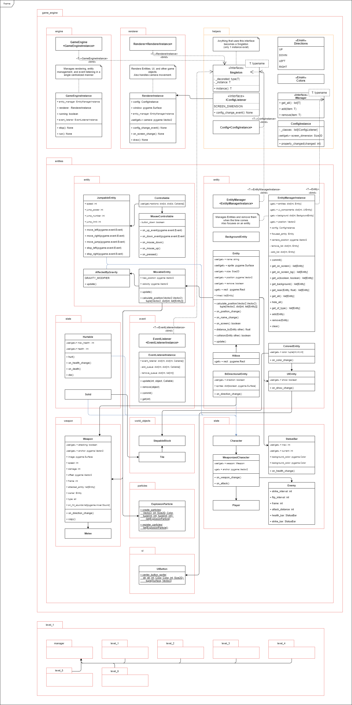

# 2drpg_pygame
2D side scrolling RPG game built on Pygame.
Here you control a character and fight monsters, and finally defeat the boss.

## Dependencies:
pygame (https://www.pygame.org/) - Python game library
abc (Abstract Base Class) (Built-in)
typing (Type Hinting) (Built-in)

## How to play:
Press A, D to move left and right.
Press W to jump.
Press S to crouch. (Not implemented yet)
Press Space to attack. (In development)

## Installation:
1. Install Python 3.8+ (https://www.python.org/downloads/)
2. Create a new Python 3 virtual environment (https://docs.python.org/3/tutorial/venv.html)
    - If you already have a Python 3 virtual environment, you can use it.
    - "python -m venv venv" creates a new virtual environment in the current directory.
3. Activate the virtual environment:
    - "source venv/bin/activate" or "venv/Scripts/activate"
    - "deactivate" to deactivate the virtual environment.
4. Install the dependencies:
    - "pip install -r requirements.txt"
5. Run the game:
    - "python main.py"

## UML and Development:
<!-- Show UML.png from ./UML.png -->
### UML Diagram
<!-- Show UML.png from ./UML.png -->

